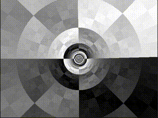

Tunnel Runner
=============

Fly through a tunnel!

Controls
--------
- Keyboard
    - WASD: Fast movement, roll
    - Arrow Keys: Slow movement, roll
- Controller
    - Left stick: Movement, roll
    - Right stick: View
    - ABXY, Left Shoulder, Right Shoulder: Change color
    - Start: Reset color
    - Back: Quit

Dependencies
------------
- [SDL 2.0.5](https://www.libsdl.org/download-2.0.php)

Reference
---------
- [Fabien Sanglard's tunnel tutorial](http://fabiensanglard.net/Tunnel/index.php)
- [Lode's tunnel tutorial](http://lodev.org/cgtutor/tunnel.html)
- [Handmade Hero](https://handmadehero.org/)
- [Handmade Penguin](https://davidgow.net/handmadepenguin/default.html)
